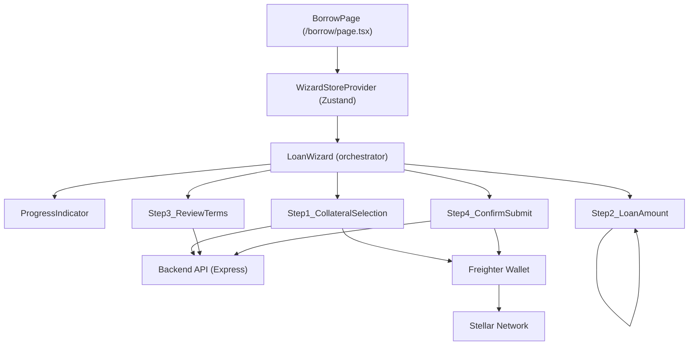

# Design Document: Loan Request Wizard

## Overview

The Loan Request Wizard replaces the existing `LoanForm` component on the `/borrow` page with a guided 4-step flow: Collateral Selection → Loan Amount → Review Terms → Confirm & Submit. A dedicated Zustand store owns all wizard state, ensuring data persists across back-navigation and that every step reads from a single source of truth. The wizard is rendered inline on the `/borrow` page using Next.js App Router with React 18 client components and styled with Tailwind CSS.

---

## Architecture



The `BorrowPage` wraps everything in the `WizardStoreProvider`. The `LoanWizard` component reads the current step from the store and conditionally renders the active step component alongside the `ProgressIndicator`. Each step component reads from and writes to the store via Zustand hooks — no step holds wizard data in local React state.

---

## Components and Interfaces

### WizardStore (Zustand)

```typescript
// src/store/loanWizardStore.ts

export type AnimalType = "cattle" | "goat" | "sheep";

export interface CollateralFields {
  animalType: AnimalType;
  count: string;          // string to allow controlled input; validated as integer
  appraisedValue: string; // string; validated as integer (stroops)
  collateralId: string;   // populated after successful on-chain registration
}

export interface LoanFields {
  loanAmount: string;     // string; validated as integer (stroops)
}

export interface RepaymentPreview {
  principal: number;
  interest: number;
  fees: number;
  remainingBalance: number;
  projectedHealthFactorBps: number | null;
  fullyRepaid: boolean;
}

export interface WizardState {
  currentStep: 1 | 2 | 3 | 4;
  collateral: CollateralFields;
  loan: LoanFields;
  repaymentPreview: RepaymentPreview | null;
  stepErrors: Record<number, string>;
  submitting: boolean;
  successLoanId: string | null;
}

export interface WizardActions {
  nextStep: () => void;
  prevStep: () => void;
  setCollateralField: <K extends keyof CollateralFields>(key: K, value: CollateralFields[K]) => void;
  setLoanField: <K extends keyof LoanFields>(key: K, value: LoanFields[K]) => void;
  setRepaymentPreview: (preview: RepaymentPreview) => void;
  setStepError: (step: number, message: string) => void;
  clearStepError: (step: number) => void;
  setSubmitting: (value: boolean) => void;
  setSuccessLoanId: (id: string) => void;
  reset: () => void;
}
```

The store is created with `create<WizardState & WizardActions>()(...)` from Zustand. The initial state sets `currentStep: 1`, all string fields to `""`, and `repaymentPreview: null`.

### LoanWizard (Orchestrator)

```typescript
// src/components/wizard/LoanWizard.tsx
// Props: { walletAddress: string }
// Reads currentStep from store, renders ProgressIndicator + active step
```

Renders:
- `<ProgressIndicator currentStep={currentStep} totalSteps={4} />`
- Conditionally: `<Step1_CollateralSelection />`, `<Step2_LoanAmount />`, `<Step3_ReviewTerms />`, or `<Step4_ConfirmSubmit />`

### ProgressIndicator

```typescript
// src/components/wizard/ProgressIndicator.tsx
// Props: { currentStep: number; totalSteps: number }
```

Renders a horizontal step track. Each step node is:
- **Completed** (step < currentStep): filled circle with checkmark, brown background
- **Active** (step === currentStep): filled circle, gold background, bold label
- **Upcoming** (step > currentStep): outlined circle, muted

Displays "Step N of 4" as a text label below the track.

### Step1_CollateralSelection

```typescript
// src/components/wizard/steps/Step1_CollateralSelection.tsx
// Props: { walletAddress: string }
```

- Reads/writes `collateral` fields from store
- On "Next": validates count > 0 and appraisedValue > 0 (integers)
- Calls `POST /api/collateral/register`, signs with Freighter, submits XDR
- On success: stores `collateralId`, calls `nextStep()`
- On failure: calls `setStepError(1, message)`

### Step2_LoanAmount

```typescript
// src/components/wizard/steps/Step2_LoanAmount.tsx
```

- Reads `collateral.collateralId` and `collateral.appraisedValue` from store (read-only display)
- Reads/writes `loan.loanAmount`
- Computes LTV live: `(loanAmount / appraisedValue) * 100`, shown to 2 decimal places
- On "Next": validates loanAmount > 0 and LTV ≤ 80%
- On success: calls `nextStep()`

### Step3_ReviewTerms

```typescript
// src/components/wizard/steps/Step3_ReviewTerms.tsx
```

- Displays read-only collateral + loan summary from store
- On mount (or when collateralId/loanAmount change): calls `POST /api/loan/repayment-preview`
- Shows loading spinner while fetching
- On success: calls `setRepaymentPreview(data)`, renders `<HealthGauge />` and breakdown table
- Shows liquidation warning if `projectedHealthFactorBps < 10_000`
- "Next" button enabled only when preview loaded successfully

### Step4_ConfirmSubmit

```typescript
// src/components/wizard/steps/Step4_ConfirmSubmit.tsx
// Props: { walletAddress: string }
```

- Displays full read-only summary (all fields + preview data)
- On "Submit": calls `POST /api/loan/request`, signs with Freighter, submits XDR
- Shows loading state, disables button during submission
- On success: calls `setSuccessLoanId(id)`, `reset()`
- On failure: calls `setStepError(4, message)`

---

## Data Models

### Wizard Step Flow

```
Step 1 (Collateral)  →  Step 2 (Amount)  →  Step 3 (Review)  →  Step 4 (Confirm)
     ↑ back                  ↑ back                ↑ back
```

### LTV Computation

```
LTV (%) = (loanAmount_stroops / appraisedValue_stroops) × 100
Maximum allowed LTV = 80%
```

### Validation Rules per Step

| Step | Field | Rule |
|------|-------|------|
| 1 | count | Integer > 0 |
| 1 | appraisedValue | Integer > 0 |
| 2 | loanAmount | Integer > 0 |
| 2 | LTV | ≤ 80% |

### API Contracts (existing, unchanged)

**POST /api/collateral/register**
```json
{ "owner": "GXXX...", "animal_type": "cattle", "count": 5, "appraised_value": 5000000 }
→ { "xdr": "..." }
```

**POST /api/loan/repayment-preview**
```json
{ "loan_id": 42, "amount": 1000000 }
→ { "loan_id": 42, "repayment_amount": 1050000, "breakdown": { "principal": 1000000, "interest": 40000, "fees": 10000, "remaining_balance": 0 }, "projected_health_factor_bps": 15000, "fully_repaid": true }
```

**POST /api/loan/request**
```json
{ "borrower": "GXXX...", "collateral_id": 42, "amount": 1000000 }
→ { "xdr": "..." }
```

---

## Correctness Properties

A property is a characteristic or behavior that should hold true across all valid executions of a system — essentially, a formal statement about what the system should do. Properties serve as the bridge between human-readable specifications and machine-verifiable correctness guarantees.

### Property 1: Step advancement requires valid inputs

*For any* wizard state where the current step's required fields are empty or invalid, calling the "Next" action SHALL NOT increment `currentStep`.

**Validates: Requirements 2.4, 3.6, 4.4, 4.5**

---

### Property 2: Back navigation preserves all field values

*For any* wizard state at step N (N > 1) with non-empty field values, calling `prevStep()` SHALL decrement `currentStep` by 1 and leave all field values in `collateral` and `loan` unchanged.

**Validates: Requirements 6.1, 6.2, 6.3, 6.4**

---

### Property 3: LTV computation is consistent

*For any* positive integer loan amount and positive integer appraised value, the displayed LTV SHALL equal `(loanAmount / appraisedValue) × 100` rounded to two decimal places, and this value SHALL be the same value used for the 80% validation check.

**Validates: Requirements 3.3, 3.5**

---

### Property 4: LTV 80% boundary enforcement

*For any* loan amount and appraised value where `(loanAmount / appraisedValue) × 100 > 80`, Step 2 validation SHALL reject the input and `currentStep` SHALL remain 2.

**Validates: Requirements 3.5, 3.6**

---

### Property 5: Whitespace/zero inputs are invalid

*For any* string input to count, appraisedValue, or loanAmount that is empty, composed entirely of whitespace, zero, or negative, the corresponding step's validation SHALL reject it and SHALL NOT advance the wizard.

**Validates: Requirements 2.2, 2.3, 3.4**

---

### Property 6: Store reset clears all state

*For any* wizard state (regardless of current step or field values), calling `reset()` SHALL return the store to its exact initial state: `currentStep = 1`, all string fields `""`, `repaymentPreview = null`, `stepErrors = {}`, `submitting = false`, `successLoanId = null`.

**Validates: Requirements 5.6, 8.4**

---

### Property 7: ProgressIndicator label matches store step

*For any* value of `currentStep` in {1, 2, 3, 4}, the rendered ProgressIndicator text SHALL contain "Step N of 4" where N equals `currentStep`.

**Validates: Requirements 1.2, 7.2**

---

### Property 8: Step errors are step-scoped

*For any* call to `setStepError(step, message)`, only `stepErrors[step]` SHALL be set; all other step error entries SHALL remain unchanged.

**Validates: Requirements 2.4, 2.7, 3.5, 4.6, 5.5**

---

## Error Handling

| Scenario | Handling |
|----------|----------|
| Collateral registration API error | `setStepError(1, errorMessage)`, stay on Step 1 |
| Freighter signing rejected | `setStepError(1, "Transaction signing cancelled")`, stay on Step 1 |
| Repayment preview API error | `setStepError(3, errorMessage)`, disable Step 3 "Next" button |
| Loan request API error | `setStepError(4, errorMessage)`, re-enable Submit button |
| Loan request signing rejected | `setStepError(4, "Transaction signing cancelled")` |
| Network timeout | Display generic error message with retry guidance |

All API calls use `try/catch`. Errors are stored in `stepErrors` keyed by step number and displayed inline within the relevant step component. No global error boundary is required for this feature.

---

## Testing Strategy

### Dual Testing Approach

Both unit tests and property-based tests are required and complementary:

- **Unit tests** cover specific examples, edge cases, and integration points (e.g., "submitting with count=0 shows the correct error message").
- **Property-based tests** verify universal invariants across randomly generated inputs (e.g., "for any valid inputs, LTV is always computed consistently").

### Property-Based Testing Library

Use **fast-check** (`npm install --save-dev fast-check`), which integrates cleanly with Vitest/Jest and supports TypeScript.

Each property test MUST run a minimum of **100 iterations**.

Tag format for each test:
```
// Feature: loan-request-wizard, Property N: <property_text>
```

### Property Test Mapping

| Property | Test Description | fast-check Arbitraries |
|----------|-----------------|------------------------|
| P1: Step advancement requires valid inputs | Generate invalid field combinations; assert `currentStep` unchanged after attempted advance | `fc.string()`, `fc.integer()` |
| P2: Back navigation preserves fields | Generate arbitrary field values at step N > 1; call `prevStep()`; assert fields unchanged | `fc.record(...)` |
| P3: LTV computation consistency | Generate positive integers; assert displayed LTV = formula result | `fc.integer({ min: 1 })` |
| P4: LTV 80% boundary | Generate amounts where LTV > 80%; assert validation rejects | `fc.integer({ min: 1 })` |
| P5: Whitespace/zero inputs invalid | Generate empty/whitespace/zero/negative strings; assert rejection | `fc.string()`, `fc.constant("")` |
| P6: Store reset | Generate arbitrary state; call `reset()`; assert initial state | `fc.record(...)` |
| P7: ProgressIndicator label | Generate step in {1,2,3,4}; assert rendered text | `fc.integer({ min: 1, max: 4 })` |
| P8: Step errors are step-scoped | Generate step + message; call `setStepError`; assert only that step changed | `fc.integer({ min: 1, max: 4 })`, `fc.string()` |

### Unit Test Coverage

- Step 1: valid submission flow (mock API + Freighter), error display on API failure, error display on signing rejection
- Step 2: LTV display updates on input change, 80% boundary (exact), back navigation
- Step 3: loading state, health factor warning at < 10 000 bps, preview error disables Next
- Step 4: full summary display, submit flow (mock API + Freighter), success message with loan ID, error re-enables Submit
- ProgressIndicator: renders correct label and active/completed/upcoming visual states
- WizardStore: all actions produce correct state transitions

### Test File Locations

```
frontend/src/__tests__/
  loanWizardStore.test.ts        # Store unit + property tests
  LoanWizard.test.tsx            # Orchestrator rendering
  ProgressIndicator.test.tsx     # Label and visual state
  Step1_CollateralSelection.test.tsx
  Step2_LoanAmount.test.tsx
  Step3_ReviewTerms.test.tsx
  Step4_ConfirmSubmit.test.tsx
```
