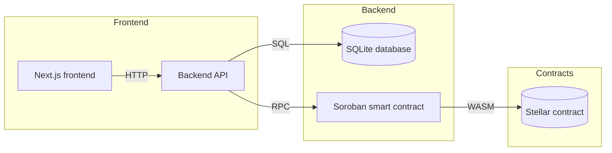

# StellarKraal

[](https://github.com/teslims2/StellarKraal-/actions/workflows/backend-ci.yml)
[](https://github.com/teslims2/StellarKraal-/actions/workflows/frontend-ci.yml)
[](https://github.com/teslims2/StellarKraal-/actions)
[](LICENSE)


link to website https://kraal-bloom-connect.lovable.app/

## Project Overview

StellarKraal enables livestock-backed loans on the Stellar network. Animals are registered as collateral and borrowers can request loans against their appraised value, with on-chain loan lifecycle management and liquidation protection.

See the [CHANGELOG](CHANGELOG.md) for release notes and upcoming changes.

## Architecture



### Architecture Summary

- Frontend: React + Next.js 14 with Tailwind CSS.
- Backend: Node.js + TypeScript + Express.
- Smart contract: Rust using the Soroban SDK.
- Infrastructure: Docker, Docker Compose, local SQLite database.

## Local Development

### Prerequisites

- Node.js 20+
- npm
- Docker & Docker Compose (for containerized setup)
- Rust toolchain and `stellar-cli` for contract work
- Freighter browser extension for wallet integration

### Clone and setup

```bash
git clone https://github.com/<your-username>/StellarKraal-.git
cd StellarKraal-
cp .env.example .env
```

### Environment Variables

Create a `.env` file in the project root containing:

| Variable | Description | Example |
|---|---|---|
| `NEXT_PUBLIC_NETWORK` | Stellar network to use | `testnet` |
| `RPC_URL` | Soroban JSON-RPC endpoint | `https://soroban-testnet.stellar.org` |
| `CONTRACT_ID` | Deployed Soroban contract ID | `G...` |
| `PORT` | Backend service port | `3001` |
| `NEXT_PUBLIC_API_URL` | Frontend API base URL | `http://localhost:3001` |
| `SHUTDOWN_TIMEOUT_MS` | Graceful shutdown drain timeout (ms, min 1000, default 10000). On SIGTERM/SIGINT the server stops accepting new connections and waits up to this duration for in-flight requests to complete before forcing exit. | `10000` |

### Run with Docker Compose

```bash
docker-compose up --build
```

Access:

- Frontend: `http://localhost:3000`
- Backend API: `http://localhost:3001`

### Run without Docker

#### Backend

```bash
cd backend
npm install
npm run build
npm start
```

#### Frontend

```bash
cd frontend
npm install
npm run dev
```

#### Smart contract tests

```bash
cd contracts/stellarkraal
cargo test
```

## Staging Environment

The staging environment mirrors production and is deployed automatically on every merge to `main`.

| Resource | URL |
|---|---|
| Frontend | `https://staging.stellarkraal.example.com` |
| Backend API | `https://api-staging.stellarkraal.example.com` |

Staging uses Stellar **testnet** RPC and a separate contract deployment. The following GitHub Actions secrets must be set under the `staging` environment (Settings → Environments → staging):

| Secret | Description |
|---|---|
| `STAGING_RPC_URL` | Soroban testnet RPC endpoint |
| `STAGING_CONTRACT_ID` | Staging contract deployment ID |
| `STAGING_API_URL` | Staging backend API base URL |
| `STAGING_FRONTEND_URL` | Staging frontend URL (for CORS) |
| `JWT_SECRET` | JWT signing key for staging |
| `SLACK_WEBHOOK_URL` | Slack webhook for deployment notifications |

To run the staging stack locally:

```bash
docker compose -f docker-compose.yml -f docker-compose.staging.yml up -d
```

## Troubleshooting

Common errors and their resolutions are documented in **[docs/troubleshooting.md](docs/troubleshooting.md)**, covering:

- **Setup** — dependency conflicts, missing CLI tools, build failures, SQLite addon errors
- **Runtime** — port conflicts, RPC connectivity, CORS, JWT errors, Docker health checks
- **Contract** — invocation errors, sequence number mismatches, missing contract deployments
- **Database** — SQLite open failures, migration conflicts

Quick reference for the most frequent issues:

| Symptom | Resolution |
|---|---|
| `PORT already in use` | Stop the process on that port or change `PORT` in `.env` |
| `Cannot connect to RPC_URL` | Verify network and RPC endpoint reachability |
| `npm test` failures | Ensure dependencies are installed and Node.js 20+ is active |
| `Docker build` errors | Rebuild with `docker-compose build --no-cache` |

For anything not listed here, see the [full troubleshooting guide](docs/troubleshooting.md).

## Contribution Guidelines

This repository uses a documented contribution workflow. See [CONTRIBUTING.md](CONTRIBUTING.md) for branch naming, commit style, PR template, and code review expectations.

### Pull Request Checklist

- [ ] Branch created from latest `main`
- [ ] Commit messages follow Conventional Commits
- [ ] Tests run successfully locally
- [ ] Documentation updated when necessary

## Lighthouse CI

Performance thresholds are enforced in `frontend/lighthouserc.js`. The CI Lighthouse job runs against the built app and **fails the build** if any score falls below:

| Category | Minimum Score |
|---|---|
| Performance | 80 |
| Accessibility | 90 |
| Best Practices | 90 |
| SEO | 80 |

Scores are reported as a GitHub Actions step summary.

## Security & Vulnerability Management

Dependencies are scanned automatically:

- **Dependabot** monitors `backend/` and `frontend/` npm packages weekly. PRs are labelled `dependencies` and `security`.
- **npm audit** runs every Monday via the [`npm-audit`](.github/workflows/npm-audit.yml) workflow. The workflow fails if any `high` or `critical` severity vulnerability is found.

To run an audit locally:

```bash
cd backend && npm audit --audit-level=high
cd frontend && npm audit --audit-level=high
```

## Development Scripts

Run the following from the repository root:

```bash
npm run test:contract
npm run test:backend
npm run test:frontend
```

## Documentation

| Document | Description |
|---|---|
| [Loan State Machine](docs/protocol/loan-state-machine.md) | All loan states, valid transitions, triggering events, and on-chain event mapping |
| [Liquidation Mechanism](docs/protocol/liquidation.md) | Health factor formula, liquidation threshold, partial liquidation examples |
| [Smart Contract Interface](docs/contracts/stellarkraal-interface.md) | Soroban contract public API, error codes, state changes, and CLI invocation guide |

## Architecture Decision Records

Key design decisions are documented as ADRs in [`docs/adr/`](docs/adr/).

| ADR | Title | Status |
|-----|-------|--------|
| [ADR-001](docs/adr/ADR-001-soroban.md) | Use Soroban for On-Chain Loan Lifecycle Management | Accepted |
| [ADR-002](docs/adr/ADR-002-jwt-auth.md) | JWT-Based Authentication Strategy | Accepted |
| [ADR-003](docs/adr/ADR-003-sqlite.md) | SQLite as the Off-Chain Database | Accepted |
| [ADR-004](docs/adr/ADR-004-nextjs-tailwind.md) | Next.js 14 + Tailwind CSS for the Frontend | Accepted |
| [ADR-005](docs/adr/ADR-005-collateral-appraisal-model.md) | Off-chain collateral appraisal model | Accepted |
| [ADR-006](docs/adr/ADR-006-oracle-design.md) | Multi-oracle median aggregation for price feeds | Accepted |

To add a new ADR, copy [`docs/adr/template.md`](docs/adr/template.md), increment the number, fill in all sections, and add a row to the table above.

---
website https://kraal-bloom-connect.lovable.app/

## License

MIT © StellarKraal
