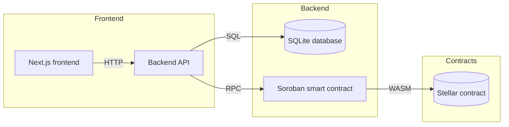

# StellarKraal

[](https://github.com/teslims2/StellarKraal-/actions/workflows/backend-ci.yml)
[](https://github.com/teslims2/StellarKraal-/actions)
[](LICENSE)

## Project Overview

StellarKraal enables livestock-backed loans on the Stellar network. Animals are registered as collateral and borrowers can request loans against their appraised value, with on-chain loan lifecycle management and liquidation protection.

## Architecture



### Architecture Summary

- Frontend: React + Next.js 14 with Tailwind CSS.
- Backend: Node.js + TypeScript + Express.
- Smart contract: Rust using the Soroban SDK.
- Infrastructure: Docker, Docker Compose, local SQLite database.

## Local Development

### Prerequisites

- Node.js 20+
- npm
- Docker & Docker Compose (for containerized setup)
- Rust toolchain and `stellar-cli` for contract work
- Freighter browser extension for wallet integration

### Clone and setup

```bash
git clone https://github.com/<your-username>/StellarKraal-.git
cd StellarKraal-
cp .env.example .env
```

### Environment Variables

Create a `.env` file in the project root containing:

| Variable | Description | Example |
|---|---|---|
| `NEXT_PUBLIC_NETWORK` | Stellar network to use | `testnet` |
| `RPC_URL` | Soroban JSON-RPC endpoint | `https://soroban-testnet.stellar.org` |
| `CONTRACT_ID` | Deployed Soroban contract ID | `G...` |
| `PORT` | Backend service port | `3001` |
| `NEXT_PUBLIC_API_URL` | Frontend API base URL | `http://localhost:3001` |

### Run with Docker Compose

```bash
docker-compose up --build
```

Access:

- Frontend: `http://localhost:3000`
- Backend API: `http://localhost:3001`

### Run without Docker

#### Backend

```bash
cd backend
npm install
npm run build
npm start
```

#### Frontend

```bash
cd frontend
npm install
npm run dev
```

#### Smart contract tests

```bash
cd contracts/stellarkraal
cargo test
```

## Troubleshooting

- `PORT already in use`: stop the process using the port or change `PORT` in `.env`.
- `Cannot connect to RPC_URL`: verify network and RPC endpoint reachability.
- `npm test` failures: ensure dependencies are installed and the correct Node.js version is active.
- `Docker build` errors: rebuild after clearing caches with `docker-compose build --no-cache`.

## Contribution Guidelines

This repository uses a documented contribution workflow. See [CONTRIBUTING.md](CONTRIBUTING.md) for branch naming, commit style, PR template, and code review expectations.

### Pull Request Checklist

- [ ] Branch created from latest `main`
- [ ] Commit messages follow Conventional Commits
- [ ] Tests run successfully locally
- [ ] Documentation updated when necessary

## Development Scripts

Run the following from the repository root:

```bash
npm run test:contract
npm run test:backend
npm run test:frontend
```

## License

MIT © StellarKraal
