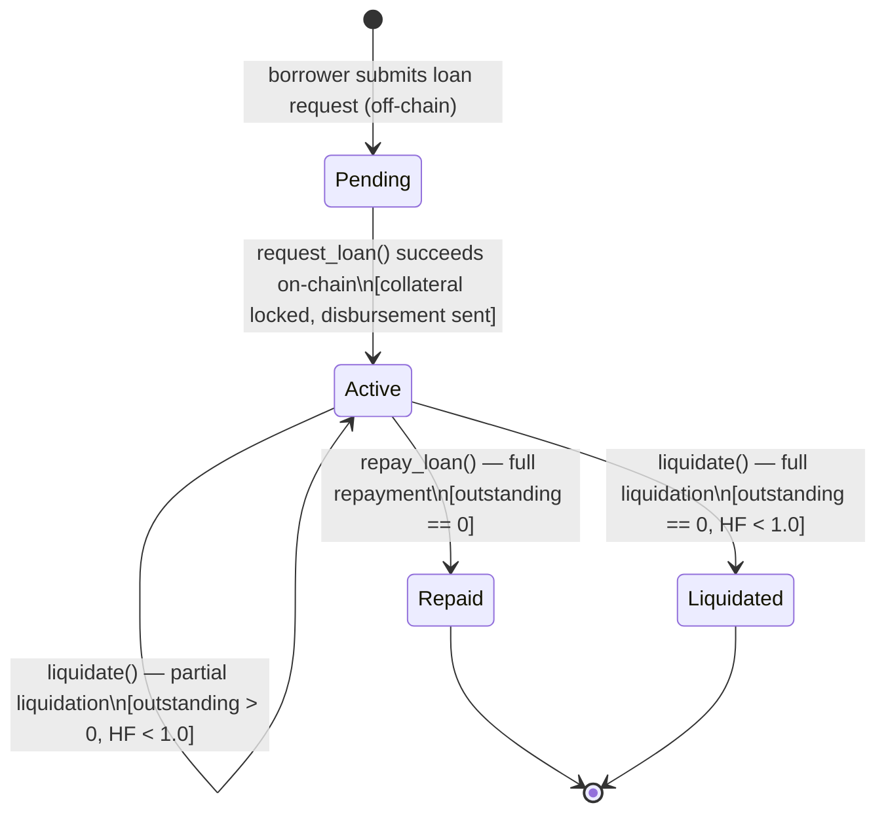

# Loan State Machine

This document describes every state a StellarKraal loan can be in, the valid transitions between states, and the events that trigger each transition.

---

## State Diagram

---

## States

### `Pending`

**Layer:** off-chain (backend database only)

The loan request has been submitted by the borrower via the backend API but the `request_loan` contract call has not yet been confirmed on-chain. Collateral is reserved in the backend but not yet locked on-chain.

**Invariants:**
- No on-chain `LoanRecord` exists yet.
- Collateral records are not yet locked (`loan_id == 0` on-chain).
- The loan has no `loan_id` assigned on-chain.

---

### `Active`

**Layer:** on-chain (`LoanStatus::Active`)

The loan is open. An on-chain `LoanRecord` exists with `outstanding > 0`. Collateral is locked to this loan. Repayments and liquidations are accepted.

**Invariants:**
- `outstanding > 0`
- All referenced collateral records have `loan_id` set to this loan's ID.
- Borrower can call `repay_loan`; liquidators can call `liquidate` if `HF < 10_000`.
- Repayment is **not** blocked when the contract is paused; new loans and liquidations are.

---

### `Repaid`

**Layer:** on-chain (`LoanStatus::Repaid`)

The borrower has paid the full outstanding balance. This is a terminal state.

**Invariants:**
- `outstanding == 0`
- No further repayments or liquidations are accepted (`LoanAlreadyClosed` error).
- Collateral records are released (can be used in a new loan).

---

### `Liquidated`

**Layer:** on-chain (`LoanStatus::Liquidated`)

The loan was fully closed through the liquidation mechanism. This is a terminal state.

**Invariants:**
- `outstanding == 0`
- No further repayments or liquidations are accepted (`LoanAlreadyClosed` error).
- Collateral transfer to the liquidator is handled off-chain via oracle settlement.

---

## Transitions

| From | To | Triggering Event | Condition |
|---|---|---|---|
| _(none)_ | `Pending` | Borrower submits loan request to backend API | Contract not paused; collateral unlocked |
| `Pending` | `Active` | `request_loan()` confirmed on-chain | `amount <= total_collateral_value × LTV / 10_000`; borrower auth; collateral owned by borrower |
| `Active` | `Active` | `repay_loan()` — partial | `repay_amount < outstanding`; borrower auth |
| `Active` | `Repaid` | `repay_loan()` — full | `repay_amount >= outstanding` (capped to `outstanding`); borrower auth |
| `Active` | `Active` | `liquidate()` — partial | `HF < 10_000`; `repay_amount <= outstanding × close_factor / 10_000`; liquidator auth |
| `Active` | `Liquidated` | `liquidate()` — full | Same as above and `outstanding` reaches 0 after repayment |

---

## On-Chain Events

Each transition emits a Soroban contract event. See [events.md](events.md) for full field definitions.

| Transition | Event topics | Key fields |
|---|---|---|
| `Pending` → `Active` | `("loan", "requested")` | `loan_id`, `borrower`, `amount`, `disbursement`, `total_collateral_value` |
| `Active` → `Active` (partial repay) | `("loan", "repaid")` | `loan_id`, `repay_amount`, `outstanding`, `status: Active` |
| `Active` → `Repaid` | `("loan", "repaid")` | `loan_id`, `repay_amount`, `outstanding: 0`, `status: Repaid` |
| `Active` → `Active` (partial liquidation) | `("loan", "liquidated")` | `loan_id`, `liquidator`, `repay_amount`, `outstanding`, `status: Active` |
| `Active` → `Liquidated` | `("loan", "liquidated")` | `loan_id`, `liquidator`, `repay_amount`, `outstanding: 0`, `status: Liquidated` |

---

## Related

- Smart contract: [`contracts/stellarkraal/src/lib.rs`](../../contracts/stellarkraal/src/lib.rs)
- Backend state machine: [`backend/src/loanStateMachine.ts`](../../backend/src/loanStateMachine.ts)
- Liquidation mechanics: [liquidation.md](liquidation.md)
- Contract events reference: [events.md](events.md)
