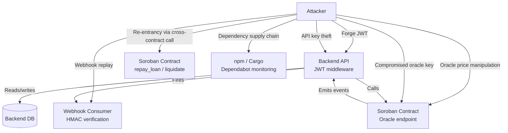

# StellarKraal Threat Model

**Status:** Living document — update when the attack surface changes significantly.  
**Last reviewed:** 2026-09-27  
**Review requested from:** at least one maintainer with a security background before merging.

---

## 1. Purpose and Scope

This document identifies the key assets StellarKraal must protect, the threat actors that may
target those assets, specific attack scenarios with their current mitigations, and residual risks
that require ongoing attention.

The threat model covers:

- The **backend API** (`backend/src/`)
- The **Soroban smart contract** (`contracts/stellarkraal/src/lib.rs`)
- The **off-chain oracle / appraisal pipeline** (`backend/src/utils/appraisalCache.ts`)
- The **webhook delivery system** (`backend/src/webhooks.ts`)
- The **Next.js frontend** (`frontend/`)

It does **not** cover:
- Individual user device security (key management on the end-user's device)
- AWS infrastructure-level threats (covered in the infrastructure runbook)
- Third-party Stellar network-level attacks (outside the protocol's control)

---

## 2. Assets

| Asset | Confidentiality | Integrity | Availability | Notes |
|-------|:-:|:-:|:-:|-------|
| JWT signing secret (`JWT_SECRET`) | Critical | Critical | High | Compromise allows forging tokens for any user |
| Refresh token store (in-memory) | High | Critical | High | Theft enables persistent session hijacking |
| Oracle signing key | Critical | Critical | High | Controls on-chain collateral pricing; compromise can drain protocol |
| Soroban contract state (loans, collateral) | Medium | Critical | Critical | Irreversible on-chain data |
| Webhook subscriber secrets | High | High | Medium | Used to authenticate deliveries; compromise allows spoofed events |
| Backend database (SQLite / PostgreSQL) | High | Critical | High | Contains loan records, collateral data, user data |
| API key store (in-memory) | High | Critical | Medium | Compromise allows M2M impersonation |
| Frontend static bundle | Low | Medium | High | Integrity matters for supply-chain attacks |

---

## 3. Threat Actors

| Actor | Motivation | Capability |
|-------|-----------|------------|
| **Opportunistic attacker** | Financial gain | Script-kiddie to moderate; exploits known CVEs and misconfigurations |
| **Targeted financial attacker** | Drain the lending protocol | High; sophisticated; may monitor oracle submissions and mempool |
| **Malicious oracle operator** | Manipulate prices for profit | Insider threat; direct oracle key access |
| **Compromised third-party dependency** | Supply-chain attack | Moderate; injects malicious code via npm or Cargo package |
| **Malicious webhook consumer** | Trigger unintended backend behaviour | Low to moderate; controls the receiving endpoint |
| **Authenticated borrower** | Over-borrow or avoid liquidation | Low technical capability; protocol-level attack surface |

---

## 4. Attack Scenarios and Mitigations

### 4.1 JWT Forgery

**Description**  
An attacker forges a valid JWT to authenticate as an arbitrary user, gaining access to protected
API endpoints, loan management, and collateral operations.

**Prerequisites**  
- Knowledge or possession of `JWT_SECRET`.

**Attack vectors**
1. `JWT_SECRET` exposed in source code, logs, or environment variable leak.
2. Weak or default secret used in production (the code ships a `change-me-in-production-min-32-chars!!` default — a misconfigured deployment may use this).
3. Algorithm confusion attack: sending a JWT signed with `alg: none` or an unexpected algorithm.

**Current mitigations**
- `JWT_SECRET` is loaded from environment variables; never hardcoded in logic paths. See [ADR-002](../adr/ADR-002-jwt-auth.md).
- `jsonwebtoken` `verify` is called with an explicit `{ algorithms: ['HS256'] }` option, rejecting `none` and RS256/ES256 algorithm confusion.
- Access tokens are short-lived (15 minutes), limiting the window after a leak.
- Refresh tokens are stored as SHA-256 hashes server-side; the raw value is never logged.
- Dependabot monitors `jsonwebtoken` and related packages for CVEs weekly.

**Residual risks**
- In-memory token denylist is not persisted across restarts; a revoked token remains valid until expiry if the server restarts.
- No JWT key rotation mechanism is currently automated — manual rotation requires a server restart.

**Recommended follow-up**
- Implement persistent token denylist (SQLite table) for immediate revocation.
- Add automated secret rotation with zero-downtime key overlap. See [docs/security/secrets-rotation.md](secrets-rotation.md).

---

### 4.2 Soroban Smart Contract Re-entrancy

**Description**  
An attacker crafts a Soroban contract call that re-enters the `stellarkraal` contract during
execution (e.g. during `repay_loan` or `liquidate`) to drain funds or manipulate loan state
before the initial call completes.

**Prerequisites**  
- A deployed adversarial contract that the victim contract calls into (e.g. a token contract
  under attacker control).

**Attack vectors**
1. Re-entrant call through a cross-contract call to an attacker-controlled token contract during
   `repay_loan`.
2. Reentrancy via a callback in a DEX or bridge integration (future surface).

**Current mitigations**
- The Soroban runtime serialises contract execution within a single transaction — there is no
  native reentrancy vector comparable to EVM's `CALL` + fallback pattern. Soroban's host
  enforces a strict call depth limit.
- The contract follows a checks-effects-interactions pattern: state is updated before any
  cross-contract call (token transfer).
- Contract is audited for reentrancy patterns. See [docs/security/contract-audit.md](contract-audit.md).
- All mutating functions (`request_loan`, `repay_loan`, `liquidate`) require explicit
  authorization via `Address::require_auth()`.

**Residual risks**
- Cross-contract interactions with future integrations (DEX, bridge) could introduce new
  reentrancy surfaces. Each new integration requires a dedicated security review.
- Soroban SDK upgrades may change host-level reentrancy guarantees — pin SDK versions and
  review changelogs before upgrading.

**Recommended follow-up**
- Maintain the checks-effects-interactions pattern in all future contract changes.
- Conduct a focused reentrancy review for any cross-contract call added in future PRs.

---

### 4.3 Oracle Manipulation

**Description**  
A malicious or compromised oracle submits a fraudulent price to the on-chain contract, enabling
under-collateralized loans (too-high price) or unjust liquidations (too-low price).

**Prerequisites**  
- Control of at least one registered oracle signing key, or ability to submit to the oracle
  endpoint without authorization.

**Attack vectors**
1. Compromise of the oracle operator key — allows submitting any price.
2. Flash price manipulation — submit a single extreme price to trigger mass liquidations or
   allow over-borrowing before the TWAP window smooths it out.
3. Stale price attack — oracle goes offline; stale prices may be used if staleness checks are
   misconfigured.
4. Quorum collusion — if `>= quorum` of registered oracles are controlled by the same party,
   median aggregation is ineffective.

**Current mitigations**
- Multi-oracle median aggregation with a minimum quorum (up to 5 oracles). A single compromised
  oracle cannot shift the median alone. See [ADR-006](../adr/ADR-006-oracle-design.md).
- On-chain TWAP (time-weighted average price) smooths liquidation pricing over a configurable
  window, preventing single-submission flash manipulation. See [ADR-007](../adr/ADR-007-oracle-twap.md).
- On-chain deviation limits reject submissions that deviate too far from the current TWAP
  (configurable `MAX_DEVIATION_BPS`).
- On-chain staleness check: the contract rejects prices older than `PRICE_STALENESS_THRESHOLD`.
- Oracle keys are managed separately from the backend application key; compromise of the
  backend does not automatically compromise oracle submissions.

**Residual risks**
- At the current stage, oracles are operated by the StellarKraal team. Quorum collusion is a
  theoretical risk if all oracle operators are the same entity.
- The TWAP window is a configurable parameter — a misconfigured short window reduces protection.
- No automated alert is triggered when the oracle submission rate drops below a threshold
  (i.e., impending staleness is not proactively surfaced).

**Recommended follow-up**
- Add a Prometheus alert rule that fires when the last oracle submission is older than
  `PRICE_STALENESS_THRESHOLD × 0.8` (early warning). See [observability/prometheus-rules.yml](../../observability/prometheus-rules.yml).
- Onboard at least one third-party oracle operator before mainnet to break the single-team quorum.

---

### 4.4 Webhook Replay Attacks

**Description**  
An attacker captures a legitimate webhook delivery and replays it to the consumer's endpoint,
causing the consumer to process the same event twice — potentially triggering a duplicate loan
approval, duplicate disbursement, or double-spend on the consumer side.

**Prerequisites**  
- Ability to intercept or record a valid webhook HTTP request (e.g. via network sniffing on an
  insecure consumer endpoint, or a MITM on HTTP — not HTTPS — consumers).

**Attack vectors**
1. Capture and replay a `loan.approved` event to trigger a duplicate disbursement on the
   consumer side.
2. Replay a `collateral.registered` event to confuse consumer inventory systems.
3. Tamper with the payload and forge a signature (requires knowledge of the webhook secret).

**Current mitigations**
- **HMAC-SHA256 per-delivery signature**: every POST includes `X-StellarKraal-Signature: sha256=<hex>` computed from the raw JSON body and the per-registration secret. Consumers must verify this header before processing. See [ADR-010](../adr/ADR-010-event-driven-architecture.md).
- **Optional AES-256-GCM payload encryption**: key derived from the webhook secret via HKDF-SHA256, providing confidentiality for sensitive financial event payloads.
- **TLS enforced on delivery**: the backend will not deliver to `http://` endpoints in production (configurable; rejected by default).
- **Event idempotency key**: each event payload includes a unique `event_id` field. Consumers must implement idempotent processing keyed on `event_id`.

**Residual risks**
- The backend does not currently add a **timestamp** field to the HMAC payload. Without a
  timestamp, there is no built-in replay window — a captured signature is valid indefinitely
  against its exact payload.
- Consumer-side idempotency is the consumer's responsibility. The backend cannot enforce it.
- Webhook secrets are stored in-memory; a backend restart clears all registrations including
  secrets, requiring consumers to re-register.

**Recommended follow-up**
- Include a `X-StellarKraal-Timestamp` header (Unix epoch seconds) in every delivery and include
  it in the HMAC calculation. Document a recommended replay window (e.g. ±5 minutes) for
  consumers to verify.
- Persist webhook registrations to the database (SQLite table) so secrets survive restarts.
- Add an example consumer verification snippet to [docs/guides/webhooks.md](webhooks.md) showing
  timestamp + signature verification.

---

## 5. Attack Surface Summary

---

## 6. Security Controls Cross-Reference

| Control | Where implemented | ADR / doc reference |
|---------|-------------------|---------------------|
| JWT HS256 verification with explicit algorithm | `backend/src/middleware/auth.ts` | [ADR-002](../adr/ADR-002-jwt-auth.md) |
| Refresh token hashing (SHA-256) | `backend/src/middleware/auth.ts` | [ADR-002](../adr/ADR-002-jwt-auth.md) |
| Challenge single-use + 5-minute expiry | `backend/src/middleware/auth.ts` | [docs/auth-flow.md](../auth-flow.md) |
| Multi-oracle median aggregation | `contracts/stellarkraal/src/lib.rs` | [ADR-006](../adr/ADR-006-oracle-design.md) |
| TWAP-smoothed liquidation pricing | `contracts/stellarkraal/src/lib.rs` | [ADR-007](../adr/ADR-007-oracle-twap.md) |
| On-chain price deviation + staleness limits | `contracts/stellarkraal/src/lib.rs` | [ADR-006](../adr/ADR-006-oracle-design.md) |
| Soroban `require_auth()` on all mutating calls | `contracts/stellarkraal/src/lib.rs` | [contract-audit.md](contract-audit.md) |
| HMAC-SHA256 webhook signatures | `backend/src/webhooks.ts` | [ADR-010](../adr/ADR-010-event-driven-architecture.md) |
| AES-256-GCM webhook payload encryption | `backend/src/webhooks.ts` | [ADR-010](../adr/ADR-010-event-driven-architecture.md) |
| Dependabot weekly CVE scanning | `.github/dependabot.yml` | [docs/guides/dependabot.md](dependabot.md) |
| npm audit on high/critical severities | `.github/workflows/npm-audit.yml` | README |
| Secrets rotation runbook | — | [docs/security/secrets-rotation.md](secrets-rotation.md) |
| Incident response plan | — | [docs/security/incident-response.md](incident-response.md) |

---

## 7. Residual Risk Register

| Risk | Severity | Likelihood | Owner | Mitigation status |
|------|:--------:|:----------:|-------|-------------------|
| Token denylist not persisted across restarts | Medium | Medium | Backend team | Open — tracked in backlog |
| No automated oracle staleness alert | Medium | Medium | DevOps | Open — prometheus rule needed |
| Webhook replay window not enforced (no timestamp in HMAC) | Medium | Low | Backend team | Open — tracked in backlog |
| Single-team oracle quorum (collusion risk) | High | Low | Protocol team | Partially mitigated (TWAP); third-party oracle onboarding planned |
| Webhook registrations lost on restart | Medium | Medium | Backend team | Open — persistence to SQLite planned |

---

## 8. Review Notes

This document should be reviewed by a maintainer with a security background before merging,
and updated whenever:

- A new authentication mechanism is added
- The oracle or webhook system changes
- A new cross-contract integration is introduced
- A security audit finding is addressed

---

## Related Documents

- [ADR-002: JWT-Based Authentication Strategy](../adr/ADR-002-jwt-auth.md)
- [ADR-006: Multi-Oracle Median Aggregation](../adr/ADR-006-oracle-design.md)
- [ADR-007: TWAP for Liquidation Price Feeds](../adr/ADR-007-oracle-twap.md)
- [ADR-010: Event-Driven Webhook Architecture](../adr/ADR-010-event-driven-architecture.md)
- [Auth Flow](../auth-flow.md)
- [Contract Audit](contract-audit.md)
- [Incident Response](incident-response.md)
- [Secrets Rotation](secrets-rotation.md)
- [SECURITY.md](../../SECURITY.md)
